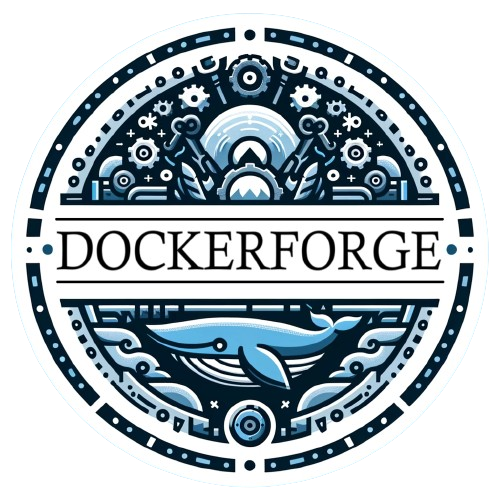
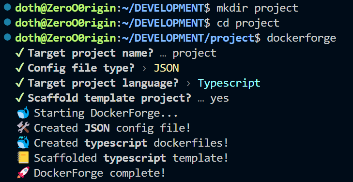
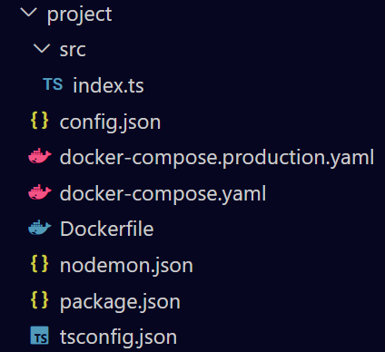

# DockerForge

<p align="center">
  
</p>

Command line tool to generate dockerfile definitions and scaffold project templates for CI/CD operations, developed in [Bun](https://bun.sh).

## **Motivation** 🔥

Upon creating Docker projects and modules, I observed a recurring pattern in the necessary files and considered streamlining it with a cli tool. Typically, to dockerize a project the directory must contain the following:

- The `src` folder containing the code.
- The `Dockefile` for building the docker image.
- (_Optionally_) the `config` file for runtime configuring.
- (_Optionally_) the `.env` file for setting environmental variables.
- (_Optionally_) the `docker-compose.yaml` for creating a Docker service stack.

Dockerforge aims to automate the production of these files, offering also scaffolded templates for the supported programming languages. This can help minize from idea, to development and production phases and reduce time required to dockerize your implementation.

## **Installation** ⚡

### Using **Bun **

To install the cli tool, execute the following command:

```bash
bun install -g dockerforge
```

### Using **Binary **

To install the cli tool using the binary, head over to X:

## **Usage** 🚀

The tool generates docker definitions ( _Dockerfile, docker-compose.yaml, docker-compose.production.yaml_ ) for the selected programming language in the current directory. This definitions include a structure for building the docker image of your application using two phases, development and production. When the `docker-compose.yaml` file is used to create a docker service then the development phase of the docker image is utilized allowing for hot-reload of your code inside the container. When the `docker-compose.production.yaml` file is invoked, then the corresponding production phase of the docker image is used. Once installed, you can use the tool interactively or with cli options by executing the `dockeforge` command:

<p align="center">
  
</p>

<!-- The tool can also scaffold a template project, creating an `src` directory for your project and the accompanying package manager for the selected language. After running the command shown above the _project_ directory has the following structure: -->

<p align="center">
  
</p>

### **Programming Languages** 📚

The tool supports docker definitions and scaffolded templates ( _`src`, language package managers_ ) for the following programming languages:

- `NodeJS` with **package.json**
- `Typescript` with **package.json** and **tsconfig.json**
- `Python` with **requirements.txt**
- `Golang` with **go.mod**
- `Rust` with **Cargo.toml**

### **CLI Options** ⚙️

The tool is interactive, but it can also be used with cli option flags. These are the following:

```console
$ dockerforge -h

Usage: dockerforge [options]

🐳 Dockerfile generator cli tool for CD/CI operations.

Options:
  -n,--name <string>      Target project name
  -e,--env                Create project .env file
  -m,--makefile           Create project Makefile
  -s,--scaffold           Scaffold template project with 'src' structure
  -c,--config <string>    Create project config file (choices: "json", "toml", "yaml", "ini", "none")
  -l,--language <string>  Target project language (choices: "typescript", "javascript", "python", "golang", "rust")
  -v, --version           Output the current version
  -h,--help               Display this help message
```

> -n, --name \<string>

- This option sets the name of the target project, this will be used in the generated dockerfile definitions. By default it set to the current working directory.

> -e, --env

- This option creates an empty `.env` inside the current working directory.

> -m, --makefile

- This option creates a `Makefile` with docker command shortcuts for development & building inside the current working directory. These command shortcuts are listed below.
- **Makefile**:
  Use `make <command>` to run this shortcuts in the cli:
  - `start`: Command shortcut for **docker-compose up -d**
  - `stop`: Command shortcut for **docker-compose down -v**
  - `build`: Command shortcut for **docker build -t project-app .**
  - `remove`: Command shortcut for **docker image rm project-app**
  - `update`: Command shortcut for running the `stop`, `remove` and `start` shortcuts sequentially.
  - `production`: Command shortcut for **docker-compose -f docker-compose.yaml -f docker-compose.production.yaml up -d**. Basicaly uses compose file along with the production compose file.
  - `run`: Command shortcut for running the code in the `src` folder.

> -s, --scaffold

- This option scaffold a project template for the selected programming language. If an `src` file already exists in the current working directory, this option will have no effect.

> -c, --config \<string>

- This option creates a configuration file of the chosen extension inside the current working directory. If a config file with the same file extention exists in the current working directory, this option will have no effect.

> -l, --language \<string>

- This option sets the target programming language of the project.

> -v, --version

- This option outputs the currect version of the tool.

> -h, --help

- This option outputs the help message shown in the previous section.
